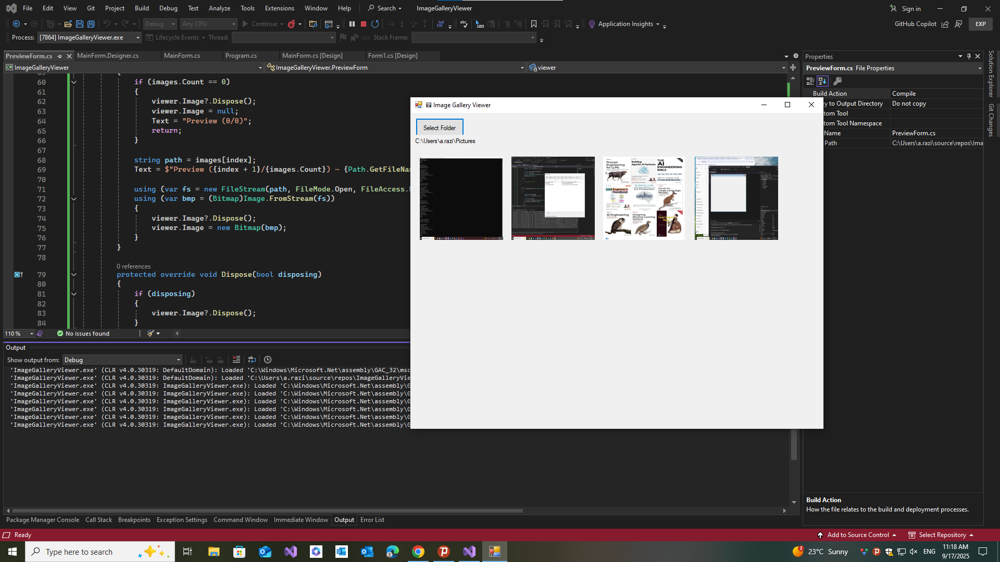

# 🖼 Image Gallery Viewer (WinForms, .NET 8)

A simple but portfolio-worthy **Windows Forms** app to browse images from any folder.  
Pick a folder → see thumbnails → click to open fullscreen → navigate with arrows.

---

## ✨ Features
- Select a folder and automatically load images (`.jpg`, `.jpeg`, `.png`, `.gif`, `.bmp`)
- Thumbnails displayed in a scrollable grid
- Click any thumbnail to open a **fullscreen preview**
- Navigate preview with:
  - **◀ / ▶ buttons**
  - **Keyboard ← / →**
  - **Esc** to close
- Memory-safe image loading (files aren’t locked)

---

## 🛠️ Tech Stack
- **.NET 8.0 Windows Forms**
- **C#** (Visual Studio 2022 or newer)
- `System.Drawing` for image handling

---

## 🚀 Getting Started

### Prerequisites
- [Visual Studio 2022](https://visualstudio.microsoft.com/vs/) (with `.NET Desktop Development` workload)  
- [.NET 8 SDK](https://dotnet.microsoft.com/en-us/download/dotnet/8.0)

### Run with Visual Studio
1. Clone or download this repo.
2. Open `ImageGalleryViewer.sln`.
3. Set the project as **Startup Project**.
4. Press **F5** to build and run.

### Run with CLI
```bash
git clone https://github.com/<your-username>/ImageGalleryViewer.git
cd ImageGalleryViewer
dotnet run --project ImageGalleryViewer.csproj
```
---

## 🎮 Usage

- Launch the app.

- Click Select Folder and choose a directory containing images.

- Browse thumbnails in the main grid.

- Click an image → open fullscreen preview.

- Use:

- ◀ / ▶ buttons or arrow keys to navigate

- Esc to close preview
---

##  📂 Project Structure

ImageGalleryViewer/

│   ImageGalleryViewer.csproj

│   Program.cs

│
├── MainForm.cs           # Logic for main window

├── MainForm.Designer.cs  # UI layout for main window

├── PreviewForm.cs        # Fullscreen preview form

└── README.md             # Documentation

---

## 📸 Screenshots 


